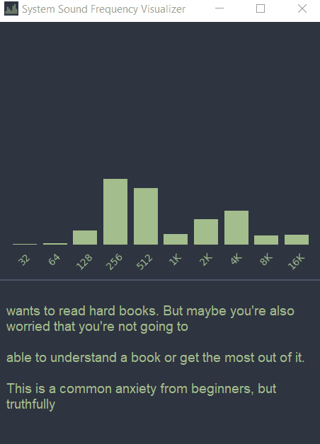

# DesktopVisualizer

Desktop Audio Visualizer + Transcriber written w/ Tkinter + Pyaudio

Audio is from https://www.youtube.com/watch?v=laXcJyx9xCc

## How to use

Run visualizer.py directly for eq + transcription, or look in dist folder for a eq only windows executable (no current transcription app *.exe build as this would require a copy of ffmpeg and whisper model in build directory)

### Notable features

Uses separate threads for pyaudio visual eq and transcription
  - system audio read is blocking and results in window freeze if not threaded separately from tkinter main loop

### Future work

**EQ**

Balance frequency bin overflow (current frequency display is inaccurate)

A-weight and scale audio for more aesthetic look

**Transcription**

Fast Diarization + More accurate Transcription

Hide & Freeze Transcription Button

Quantize a larger Whisper model

### Credits

Transcription framework comes from https://github.com/SevaSk/ecoute, and transcription model is OpenAI's tiny Whisper model.
